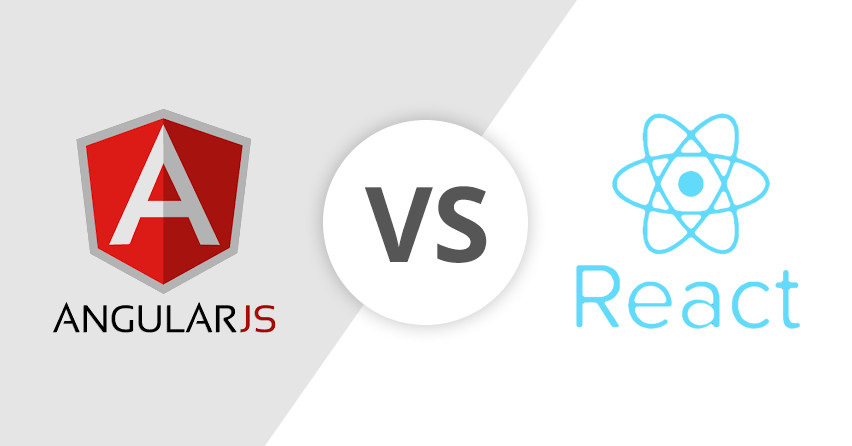

**A small story,** I live in Bangalore, India and two years back I did a trek to Skandagiri (and I am not an avid trekker, I guess that was my one and only trek). It's a small peak with 5 km steep trek and one has to do it overnight so that one can witness the sunrise from the peak. It was exciting for like first 15-20 minutes and then you start hating it, you start questioning why you signed up yourself for this trek even when your friends ditched you last minute. Once you're in the middle of it you make your peace with the trek and just go on. Step by step you push yourself towards the peak of the hill hoping that the trek will end soon. Mind you, the trek is not fun especially when you're doing it alone away from the group.

Let's come back to how it feels when you move from Angular to React. **First,** you try it because let’s face it everyone is using it and praising it.

**Second,** you get frustrated because the learning curve is steep. You have to get into Webpack, ES6, fetch, redux and everything all at once while learning React. Plus the frustration of making choices: Redux or Flux, thunk or promise, fetch or axios, there’s no right way and trust me none of the starter kit works! ( React-App is way too basic for anything good )

**Third,** you run your program you get even more frustrated now. No two way binding, then there’s JSX so you have className vs class errors as you’re used to writing HTML from as far as you remember. Still you keep writing hoping that one day it will make sense.

**Fourth,** After writing, let’s say two to three medium sized apps you have made your peace with the ecosystem, with the boilerplate code, with the ‘React’ way of doing things, with one way data flow etc. etc. Given any feature now, you can implement it in React with ease but you still don’t understand why all the trouble?

**Lastly,** since your code is growing, one day your program does something unexpected! And it takes you 5 minutes only to identify what went wrong and fix it. Then and there it hits you! You now understand why all the trouble and that’s when you fall in love with React!

You’re happy now because you know that the actual React/Redux API is minimal. *Things are mostly pure JavaScript.* You are happy that you have learned some functional way of doing web development. And let’s be honest for a second, ES6 and Webpack both were worthy of the investment you put in coz the power you get in the language (ES6) and the build system with bundling, cache busting, gzip, hot reload and what not (Webpack) has spoiled you for good!

**To end my trekking story:** I have fallen in love with the beauty of the valley's view after climbing the mountain.

P. S. Here I am at Skandagiri's peak:

