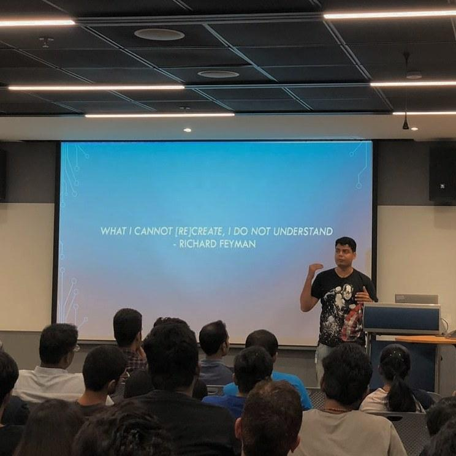

**Post event update:** Event was awesome. We had two rooms full of 200+ attendees. Here's a pic someone shared with me from the event. This was one of my opening slides which was loved by the audience.

**The pre event synopsis:**
We were trying to push the boundaries of web performance with React in Microsoft Teams when we were left with no choice but to get into React’s souce code. What came out was an appreciation of the React’s new Fiber architecture and this talk. This will get into the story of how a bug in React made us all understand Fiber better and in turn advance our Javascript performance knowledge. This isn’t a walk through of the souce code, rather an easy going explanation of one of the biggest rewrites in our beloved library and how those learnings can be applied anywhere, even outside React ecosystem.

This event is free of cost though it needs prior reservation.
RSVP here [ReactJS Bangalore #39](https://www.meetup.com/ReactJS-Bangalore/events/254937436/)
